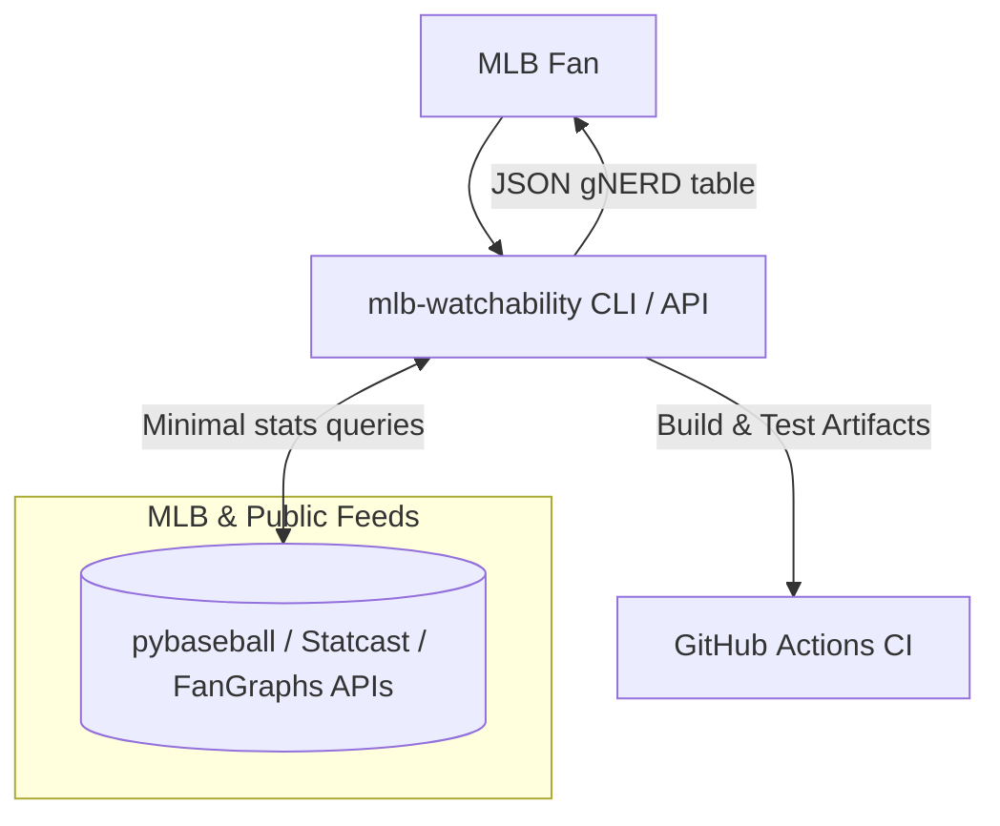
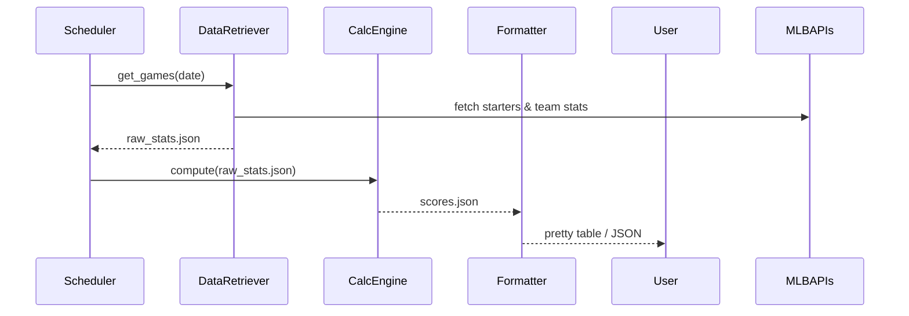

# Architecture Specification – MLB Watchability

## 1. Overview

MLB Watchability is a Python‑based system that ranks every Major League Baseball game on a given day by an overall “Game NERD” (gNERD) score so fans can quickly decide which match‑ups are the most entertaining to watch or listen to. A daily job gathers the minimal statistics needed, computes pitcher (pNERD), team (tNERD), and game (gNERD) scores, and exposes them via a CLI today (with room to grow into an API or web UI). (raw.githubusercontent.com (https://raw.githubusercontent.com/aenfield/mlb-watchability/main/specs/vision-and-reqs.md))

## 2. System design

### 2.1 Context (C4 Level 1)



### 2.2 Component interactions (Level 2)



## 3. Tech‑stack recommendations

| Layer                | Choice                       | Rationale                                                                                       |
| -------------------- | ---------------------------- | ----------------------------------------------------------------------------------------------- |
| Language             | Python ≥ 3.12                | Matches constraint to use “recent Python”; strong data-science ecosystem.                       |
| Dependency mgr       | UV                           | Ultrafast resolver; single tool for venv + lock; aligns with requirement.                       |
| Data access          | pybaseball                   | Provides Statcast, FanGraphs, and Baseball-Reference endpoints with one API; already suggested. |
| CLI framework        | Typer                        | Modern, type-safe CLI over Click; easy testing.                                                 |
| DataFrame            | Polars (or Pandas)           | Columnar, fast, zero-copy; simplifies z-score & vector math.                                    |
| Testing              | pytest + pytest-mock         | De-facto standard, rich fixtures; mock network calls.                                           |
| CI/CD                | GitHub Actions               | Native to repo; schedule workflows; free minutes.                                               |
| Packaging            | PEP 621 + pyproject.toml     | Declarative; works with UV.                                                                     |
| Optional persistence | SQLite (duckdb for columnar) | Zero-config; store historical scores if desired.                                                |

## 4. High‑level modules / services

| Module               | Responsibilities                                                                                                    |
| -------------------- | ------------------------------------------------------------------------------------------------------------------- |
| game_loader          | Query schedule for a target date; return list of games & probable starters.                                         |
| stat_retriever       | Pull only the stats required for pNERD/tNERD for the identified starters & teams (minimises API calls).             |
| nerd_calculator      | Vectorised computation of z-scores and formulas; enforce caps and positive-only rules.                              |
| score_formatter      | Merge results, sort by gNERD, output JSON/pretty table.                                                             |
| cli_app              | Glue layer using Typer; parse date flag, invoke modules, print to stdout.                                           |
| tests/               | Unit tests (calculator with fixed fixtures) and integration tests (network calls mocked or live, behind `-m live`). |
| scheduler (optional) | GitHub Actions workflow or cron to run daily and push artefact/site.                                                |

## 5. Data storage / access

- Ephemeral in memory for v0.1 – statistics loaded into DataFrames → calculations → discard.
- Optional local DB (SQLite / DuckDB) to cache raw pulls & computed scores for historical visualisation or re-runs.
- Use simple repository pattern (`repo.py`) to abstract reads so swapping storage is non-breaking.

## 6. Infrastructure & deployment

| Environment          | Details                                                                                                              |
| -------------------- | -------------------------------------------------------------------------------------------------------------------- |
| Local dev            | `uv install` → `uv run mlb-watchability --date 2025-07-04`.                                                          |
| CI pipeline          | GitHub Actions: matrix on OS / Python; `uv pip sync`, run tests, build wheel.                                        |
| Daily job            | Scheduled workflow (or AWS Lambda with EventBridge) calls CLI, commits `scores-YYYY-MM-DD.json` to `gh-pages` or S3. |
| Container (optional) | Distroless image with CPython, UV, app code; used for Lambda or K8s CronJob.                                         |

## 7. Security & compliance

- Read-only public data – no PII; low risk.
- Lock dependency versions; enable Dependabot.
- Add GitHub OIDC secrets if future paid APIs are used.
- Enforce `--require-hashes` in UV to prevent supply-chain attacks.
- Use Bandit and ruff in CI for static analysis.
- Follow MIT License compatibility for `pybaseball` and FanGraphs terms of use.

## 8. Open questions & assumptions

- Do we need to store historical gNERD scores for trend analytics or publish only current day?
- Should the constant terms (3.8, 4.0) be configurable via YAML?
- Rate limits of pybaseball endpoints—do we require local caching layer?
- Target users beyond CLI—REST API? web front-end?
- How to handle double-headers and opener/bullpen games where starters are unknown?

## 9. Future considerations

- Web UI – React/Next.js site fed from JSON artefacts; sortable tables, charts.
- Notification Bot – Slack/Discord bot that posts top-5 watchable games daily.
- Historical analytics – store multi-season gNERD scores to validate metric predictive value.
- Parallel data pulls – switch to `httpx` + async for faster retrieval.
- Containerised microservice – expose `/games?date=` endpoint; scale with Kubernetes HPA on opening week traffic.
- ML enhancements – train model to predict “watchability” using additional inputs (e.g. playoff impact, rivalry flag).

```

```
