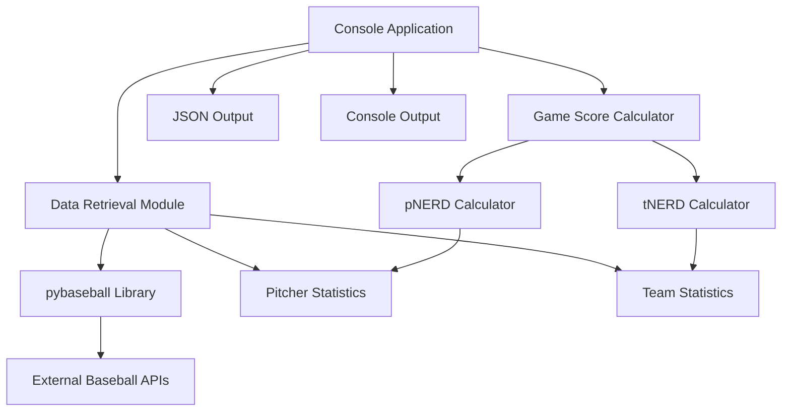
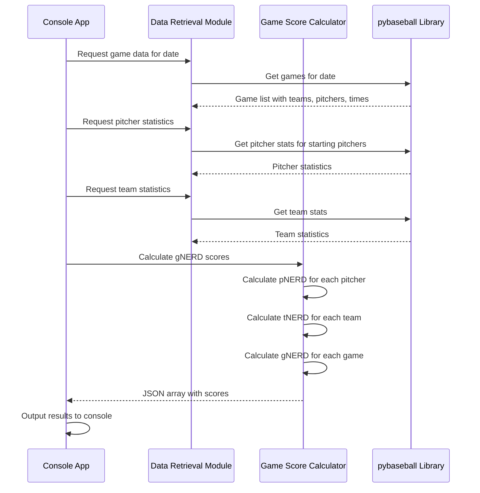

# Architecture specification

## Overview

MLB Watchability is a Python-based command-line application that calculates "Game NERD scores" (gNERD) for MLB games to help users identify the most watchable games on any given day. The system combines pitcher-specific statistics (pNERD) and team-specific statistics (tNERD) to generate an overall watchability score for each game.

This project revives the approach originally developed by Carson Cistuli at FanGraphs, providing baseball fans with data-driven recommendations for which games to watch when multiple games are available.

## System design

### High-level architecture



### Data flow



## Tech stack recommendations

### Core language and runtime
- **Python 3.11+**: Modern Python version with excellent performance and typing support
- **UV**: Fast, modern Python package manager and project manager replacing pip/pipenv/poetry

### Key libraries
- **pybaseball**: Primary data source for MLB statistics and game information
  - Justification: Specifically designed for baseball data, actively maintained, comprehensive coverage
- **pandas**: Data manipulation and analysis (likely included with pybaseball)
- **pytest**: Testing framework for unit and integration tests
- **pydantic**: Data validation and settings management for configuration

### Development tools
- **black**: Code formatting
- **ruff**: Fast linting and code quality checks
- **mypy**: Static type checking

## High-level modules/services

### 1. Data retrieval module (`mlb_watchability/data_retrieval.py`)
- **Purpose**: Fetch game schedules and statistical data from external sources
- **Key functions**:
  - `get_games_for_date(date)`: Returns list of games with teams, pitchers, and times
  - `get_pitcher_stats(pitcher_names, season)`: Retrieves pitcher statistics needed for pNERD
  - `get_team_stats(team_names, season)`: Retrieves team statistics needed for tNERD
- **Dependencies**: pybaseball library

### 2. Score calculator module (`mlb_watchability/calculator.py`)
- **Purpose**: Calculate pNERD, tNERD, and gNERD scores
- **Key functions**:
  - `calculate_pnerd(pitcher_stats)`: Calculates pitcher NERD score
  - `calculate_tnerd(team_stats)`: Calculates team NERD score
  - `calculate_gnerd(game_data)`: Calculates game NERD score
  - `calculate_z_score(value, population)`: Utility for z-score calculations
- **Dependencies**: pandas, numpy

### 3. Console application (`mlb_watchability/cli.py`)
- **Purpose**: Command-line interface orchestrating data retrieval and calculation
- **Key functions**:
  - `main()`: Entry point for CLI application
  - `format_output(results)`: Format results for console display
  - `parse_arguments()`: Handle command-line arguments (date, output format)
- **Dependencies**: argparse, datetime

### 4. Data models (`mlb_watchability/models.py`)
- **Purpose**: Type definitions and data structures
- **Key classes**:
  - `Game`: Represents a single game with teams, pitchers, time
  - `PitcherStats`: Pitcher statistics for pNERD calculation
  - `TeamStats`: Team statistics for tNERD calculation
  - `GameScore`: Complete game with all calculated scores

## Data storage and access layers

### External data sources
- **Primary**: pybaseball library accessing FanGraphs, Baseball Reference, and MLB APIs
- **Data types**:
  - Game schedules and matchups
  - Pitcher statistics (xFIP-, SwStrk, Strk, Velo, Age, Pace, ERA-, KN%)
  - Team statistics (Bat, HR%, BsR, Bull, Def, Pay, Age, Luck)

### Data caching strategy
- **In-memory caching**: Cache statistical data for the duration of a single run
- **No persistent storage**: Keep the application stateless for simplicity
- **Future consideration**: Add local caching for frequently accessed data

### Data validation
- Use pydantic models to validate incoming data from external APIs
- Handle missing or invalid data gracefully with appropriate defaults or errors

## Infrastructure and deployment

### Development environment
- **UV workspace**: Manage Python version and dependencies
- **pyproject.toml**: Project configuration and dependency specification
- **GitHub Actions**: CI/CD pipeline for testing and validation

### Deployment strategy
- **Distribution**: Python package installable via UV
- **Execution**: Command-line tool (`uv run mlb-watchability-cmd`)
- **Platform**: Cross-platform (Windows, macOS, Linux)

### CI/CD pipeline
```yaml
# .github/workflows/ci.yml structure
- Python version matrix testing (3.11, 3.12)
- Dependency installation with UV
- Linting with ruff
- Type checking with mypy
- Unit and integration tests with pytest
- Code coverage reporting
```

## Security and compliance considerations

### Data security
- **API Key Management**: If required by data sources, store API keys in environment variables
- **Rate limiting**: Implement respectful rate limiting for external API calls
- **Data privacy**: No personal user data collected or stored

### Compliance
- **Terms of Service**: Ensure compliance with pybaseball and upstream data source terms
- **Attribution**: Proper attribution to original NERD score methodology and data sources
- **Open source**: MIT or Apache 2.0 license for code sharing

## Open questions and assumptions

### Assumptions
1. **Data availability**: pybaseball provides all required statistics for NERD calculations
2. **Starting pitcher data**: Starting pitcher information is available and accurate on game day
3. **Season context**: Current season statistics are sufficient for calculations
4. **Daily usage**: Tool will be run daily rather than requiring historical data persistence

### Open questions
1. **Data freshness**: How current must the statistics be? Same-day updates required?
2. **Incomplete data**: How to handle games where starting pitchers are not yet announced?
3. **Historical data**: Should the tool support historical game analysis?
4. **Performance**: Are there performance requirements for large date ranges?
5. **Configuration**: Should statistical weights and constants be configurable?

## Future considerations

### Phase 2 enhancements
- **Web interface**: Flask/FastAPI web service for broader accessibility
- **Data visualization**: Charts and graphs for score trends and analysis
- **Historical analysis**: Compare predicted vs. actual game excitement
- **Notifications**: Alert system for high-scoring games

### Scalability improvements
- **Database integration**: PostgreSQL or SQLite for persistent data storage
- **API rate limiting**: More sophisticated caching and rate limiting
- **Batch processing**: Support for calculating scores for multiple days
- **Real-time updates**: Live score updates during games

### Advanced features
- **Machine learning**: Improve scoring algorithm with ML techniques
- **User preferences**: Personalized scoring based on team preferences
- **Social features**: Share recommendations and discuss games
- **Mobile app**: Native mobile application for on-the-go recommendations

### Technical debt management
- **Performance profiling**: Identify and optimize bottlenecks
- **Error handling**: Comprehensive error handling and logging
- **Documentation**: API documentation and user guides
- **Monitoring**: Application performance and usage metrics